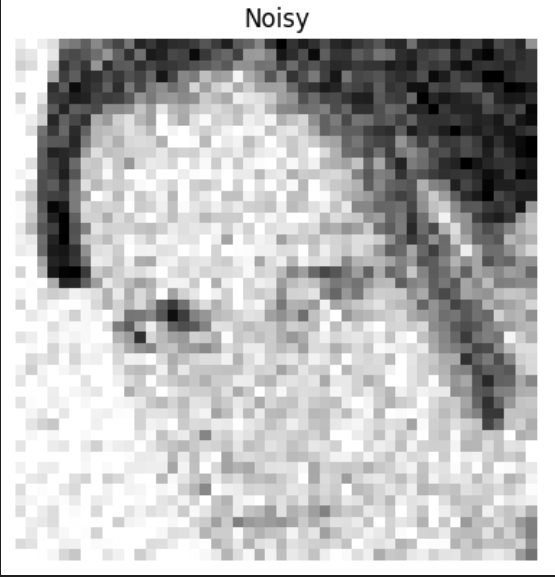
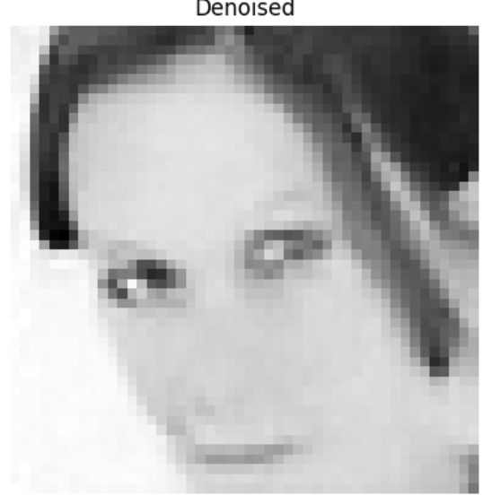

# 🧹 GAN-based Denoising Notebook (RDUNet + PatchDiscriminator)

A research-oriented Jupyter Notebook for **learning-based denoising** with a **GAN** setup: an RDUNet **generator** paired with a **PatchDiscriminator**.  
This repo demonstrates **noisy → clean** restoration using an **adversarial loss + L1 reconstruction loss**, with full training/validation loops, TensorBoard logging, checkpoints, and sample visualizations.

---
## 🔑 Key Features

- **Model Architecture**  
  - **Generator:** RDUNet for image restoration.  
  - **Discriminator:** PatchGAN to distinguish noisy vs. clean images.  

- **Training Setup**  
  - Loss functions: Adversarial loss (BCE) + L1 reconstruction loss.  
  - Optimizers: Adam for both Generator and Discriminator.  
  - Full training/validation loop with checkpoints and sample outputs.  

- **Evaluation & Logging**  
  - Metrics: PSNR and SSIM for image quality.  
  - TensorBoard logging of losses (Generator, Discriminator, GAN, L1).  
  - Visualization of noisy → denoised → clean results.  

---

## 📊 Example Results

| Input Example | Denoised Output |
|---------------|-----------------|
|  |  |

---

---

## 🛠️ Technologies Used

- **Python 3.8+**
- [NumPy](https://numpy.org/)
- [Matplotlib](https://matplotlib.org/)
- [SciPy](https://scipy.org/)
- [scikit-image](https://scikit-image.org/)
- [PyWavelets](https://pywavelets.readthedocs.io/) (optional for wavelet transforms)

---

## 📜 License

This project is released under the **MIT License**.  
You are free to use, modify, and distribute this code with attribution.

---

## 🙌 Acknowledgments

- Open-source Python scientific libraries.
- Classic signal and image processing literature.
- Inspiration from real-world noisy datasets and their denoising challenges.

---

## 💡 Contributing

Contributions are welcome!  
If you have suggestions for new denoising techniques, optimizations, or visualizations, feel free to open an **issue** or submit a **pull request**.

---

## 👤 Author

Developed by **Sadra Berangi**  
